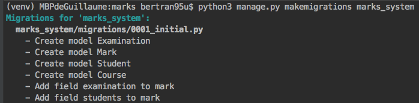
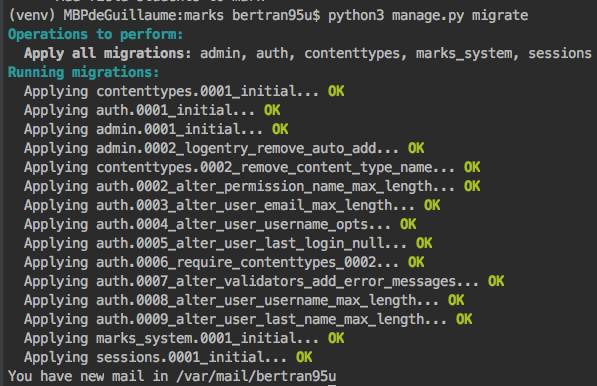

# Projet : Gestion de notes des élèves 
Remarque :
 * Django n'est rien d'autre qu'un framework MVT / proche du MVC 
 * Pourquoi  un tutoriel ou "dicter ce que l'on doit faire" ?
    * avant de pouvoir agir par soi-meme il est preferable d'avoir connaissance du sujet et de maitriser celui-ci. Ce tp s'adresse a des debutants en django et nous a de futures confirmes a qui ont donnerait des exercices de perfectionnement.
 * le temps, nous ne traiterons qu'en partie le sujet, l'interêt est d'abord pédagogique
 * montrer au final qu'en apparence tout comme PHP, Python n'est pas forcement synonyme de travail de mauvaise qualité ou d'innefficacité   
GB, KB

## Prerequis / installations
[se reporter a la procédure d'installation pour plus de détails] 
Python 3 (3.6.4) 
pip pour Python 3 (9.0.1)
django 2.0

## 1 - créer un projet "marks"
```bash
django-admin startproject marks
```

## 2 - tester le fonctionnement de l'environnement de travail
(Hello World)

Remarque : pour les utilisateurs de PyCharm, JetBrains utilise par defaut le virtualenv qui permettent de garder un ecosystème python (paquets installés) "propre"
Il est donc probable que vous deviez réinstaller django si vous utiliser la ligne de commande integree à PyCharm

- la plupart des actions seront opérées depuis le premier repertoire marks contenant le fichier manage.py (python3 manage.py command ressemble un peu à  php artisan command dans laravel..)
- le serveur ci-dessous NE doit ETRE utilisé QUE pour du développement
```bash
python3 manage.py runserver
```
Le port par défaut est 8000, si vous devez spécifier celui-ci, utilisez la commande ci-dessous: 
```bash
python3 manage.py runserver 3000
```
Effectuer un ctrl + c permet d'arrêter le serveur  
 
vous n'avez pas besoin de relancer le serveur à chaque modification (sauf plantage complet).


## 3 - créer une application marks_system
Remarque : en django un projet peut contenir plusieurs applications
```bash
python3 manage.py startapp marks_system
```

### 3.1 - créer une premiere vue 
Remarque : en django l'appelation views désigne + - un contrôleur
* ouvrir le fichier views.py dans le repertoire marks_system
le modifier (**marks_system/views.py**):
```python
from django.http import HttpResponse
def index(request):
    return HttpResponse("Hello, world. You're at the marks_system index.")
```

### 3.2 - créer un fichier d'urls spécifiques a marks_system
Remarque : nous avons un empilement d'urls 
1. le fichier du projet **marks/urls.py** correspond aux urls disponibles à la racine **127.0.0.1:8000/admin** par exemple 
2. créer le fichier urls.py dans le repertoire marks_system (**marks_system/urls.py**)
3. le fichier que l'on vient de créer correspond aux urls pour l'application marks_system qui sont préfixées par "marks-system"

```python
from django.contrib import admin
from django.urls import include, path
from django.conf.urls.static import static
from django.conf import settings

urlpatterns = [
    path('admin/', admin.site.urls),
    # inclure les sous-urls de notre application marks_system
    path('marks-system/', include(marks_system))
    # hack dysfonctionnement de la configuration de base
] + static(settings.STATIC_URL, document_root=settings.STATIC_ROOT)
# le + [..] static [..] correspond a un hack en theorie il est completement vu les parametres renseignes dans settings
```

### 3.3 - créer vos models
Remarque : 
- un model est une classe représentant une table et ses relations
- géneralement on réunit la définition de tous les models dans le fichier models.py (**marks_system/models.py**)
- nous allons modéliser de manière triviale la problématique _pour l'instant_

il est conseillé de se reporter au diagramme de classes **aide/models33**
les clefs etrangères et l'id (clef primaire) n'y sont pas représentées
```python
from django.db import models
from django.utils import timezone

import datetime
# Create your models here.
class Examination(models.Model):
    name = models.CharField(max_length=70)
    date = models.DateTimeField('examination date')

    def __str__(self):
        return self.name

class Student(models.Model):
    last_name = models.CharField(max_length=200)
    first_name = models.CharField(max_length=200)
    birth_date = models.DateTimeField('birth date')

    def __str__(self):
        return self.last_name + ' ' + self.first_name + ' birthDate : ' + str(self.birth_date)

class Course(models.Model):
    code = models.CharField(max_length=15)
    subject = models.CharField(max_length=50)
    start_date = models.DateTimeField('start date')
    end_date = models.DateTimeField('end date')

    students = models.ManyToManyField(Student)
    # students = models.ManyToManyField(Student, on_delete=models.CASCADE)
    examination = models.OneToOneField(
        Examination,
        on_delete=models.CASCADE,
        primary_key=True,
    )

    def __str__(self):
        return self.code

class Mark(models.Model):
    mark = models.DecimalField(decimal_places=2, max_digits=4)

    students = models.ManyToManyField(Student)
    examination = models.ForeignKey(Examination, on_delete=models.CASCADE)


    def __str__(self):
        return str(self.mark)
```

### 3.4 - un peu de paramètrage
nous rajoutons 'marks_system.apps.MarksSystemConfig,'`dans fichier **marks/settings.py** a la liste INSTALLED_APPS tel que
il vous est fortement conseillé de vérifier :
- les oublis de virgules
- les noms

sinon vous serez confontés à des erreurs incompréhensibles à l'étape suivante

````python
# Application definition

INSTALLED_APPS = [
    # Ici !
    'marks_system.apps.MarksSystemConfig',
    'django.contrib.admin',
    'django.contrib.auth',
    'django.contrib.contenttypes',
    'django.contrib.sessions',
    'django.contrib.messages',
    'django.contrib.staticfiles',
]
````

Ainsi nous avons indiquer à notre projet django la préscence d'une application de gestion des notes
### 3.5 - migration des models de donnees
Remarque le process de migrations est decoupe en 2 sous etapes sur django :
1. stocker les changements opérés sur les modèles
2. opérer les modifications en base de données

#### 3.5.1 - stocker les changements opérés sur les modèles dans des migrations
```bash
python3 manage.py makemigrations marks_system
```
cf. **aide/makemigrations.png**


#### 3.5.1 - operer les modifications en base de données
```bash
python3 manage.py migrate
```
cf. **aide/migrate.png**


### 3.6 et si on voulait un simple CRUD : site d'administration

#### 3.6.1 créer un administrateur
Remarque : le mot de passe choisi devra comporter plus de 8 caractères
```bash
python3 manage.py createsuperuser
```

#### 3.6.2 ajoutons nos models au site d'administration
Nous effectuons cette opération via le fichier **marks_system/admin.py**
Soit
```python
from django.contrib import admin
from .models import *

# Register your models here.
admin.register(Course, Examination, Student, Mark)(admin.ModelAdmin)
```

Nous accédons à un site permettant de faire du CRUD completement preconcue et entièrement paramètrable a l'aide de certaines variables predefinies.
Notre exploration de celui-ci s'arrêtera a créer des données pour pouvoir travailler 

(vous pouvez utiliser directement le fichier sqllite
ou 
les inserts (**aide/dump/inserts.sql**)
 si vous souhaitez passer sur cette étape)

Nous vous suggérons de proceder ainsi :
1. créer 2 _Examination_
2. créer 3 _Student_
3. créer 2 _Course_
4. créer une _Mark_ pour chaque etudiant et chaque _Examination_

### 3.7 réaliser des views (contrôleurs..) et des templates (vues)
1. créer un dossier templates et ecapsuler y un dossier marks_system
2. ajouter au dossier marks_system/templates/marks_system
    * index.html
    * course_detail.html
    * update_course.html
    * students.html
    * student_detail.html
3. toutes les vues / templates que vous désirez

Ceci dit, le temps étant limité nous n'effecturons certainement pas toutes les possibilitées


#### 3.7.1 Commencons par la créer nos templates
Remarque : django comme nombre de ses concurents à un système de templating
Commencons par définir le template de base utilisé sur toutes nos pages
* base.html :
```python
<!DOCTYPE html>
<html lang="en">
<head>
    <meta charset="UTF-8">
    <title>Title</title>
    
    <link rel="stylesheet" type="text/css" href=""/>
    <link rel="stylesheet" href="https://cdnjs.cloudflare.com/ajax/libs/twitter-bootstrap/3.3.7/css/bootstrap.min.css">
    <style>
        form input {
            display: block;
            margin-bottom: 0.5em;
        }
    </style>
</head>
<body>

<nav class="navbar navbar-default">
    <div class="container-fluid">
        <div class="navbar-header">
            <button type="button" class="navbar-toggle collapsed" data-toggle="collapse" data-target="#navbar"
                    aria-expanded="false" aria-controls="navbar">
                <span class="sr-only">Toggle navigation</span>
                <span class="icon-bar"></span>
                <span class="icon-bar"></span>
                <span class="icon-bar"></span>
            </button>
            <a class="navbar-brand" href="#">Marks system</a>
        </div>
        <div id="navbar" class="navbar-collapse collapse" aria-expanded="false" style="height: 1px;">
            <ul class="nav navbar-nav">
                <li class="active"><a href="http://127.0.0.1:8000/marks-system/">Courses</a></li>
                <li><a href="http://127.0.0.1:8000/marks-system/students/">Students</a></li>
                <li><a href="#">Contact</a></li>
                <li class="dropdown">
                    <a href="#" class="dropdown-toggle" data-toggle="dropdown" role="button" aria-haspopup="true"
                       aria-expanded="false">Dropdown <span class="caret"></span></a>
                    <ul class="dropdown-menu">
                        <li><a href="#">Customize me</a></li>
                        <li><a href="#">Customize me</a></li>
                        <li role="separator" class="divider"></li>
                        <li class="dropdown-header">Customize me</li>
                        <li><a href="#">Customize me</a></li>
                        <li><a href="#">Customize me</a></li>
                    </ul>
                </li>
            </ul>
            <ul class="nav navbar-nav navbar-right">
                <li class="active"><a href="./">Default <span class="sr-only">(current)</span></a></li>
                <li><a href="#">Customize me</a></li>
            </ul>
        </div><!--/.nav-collapse -->
    </div><!--/.container-fluid -->
</nav>

Default content

<script src="https://ajax.googleapis.com/ajax/libs/jquery/1.11.3/jquery.min.js"></script>
<script src="https://cdnjs.cloudflare.com/ajax/libs/twitter-bootstrap/3.3.7/js/bootstrap.min.js"></script>

</body>
</html>
```

Nous remarquerons :
1. l'utilisation du mot clef `block`
2. la définition d'éléments par défaut comme `Default content`

Ensuite nous allons pour chaque page 
1. definir l'url correspond a la page (dans **marks_system/urls.py**)
3. définir la view ou la méthode à utiliser dans `views.py` (contôleur) 
3. définir le template représentant la page
4. valider le fonctionnement de la nouvelle page

* index.html

/1 url

On ajoute l'url suivante :
```python
    # ex: /marks_system/ all courses
    path('courses/', views.IndexView.as_view(), name='index'),
```

2/

On va utiliser un raccourci de django pour gérer une liste d'éléments
On va dans le fichier **marks_system/views.py**

On ajoute la classe suivante
```python
class IndexView(generic.ListView):
    # nom du template
    template_name = 'marks_system/index.html'

    def get_queryset(self):
        """Return courses."""
        return Course.objects.all()
        
    # On peut meme ne pas definir le template_name puisqu'il a une valeur par defaut
    # Il s'agit seulement d'ameliorer la terminologie 
    # la plupart des parametres ici sont implicites et non mentionnes, par exemple l'objet course_list
    # passe a la vue : django detecte automatiquement le type de modele pour generer celui avec un nom par defaut
```

3/ on définit le template 
```python

Courses


<div class="container">
    <h1>Courses list</h1>

<ul>
    
    <li><a href="">{{ course.code }} {{ course.subject }}</a></li>
    
</ul>

<p>No courses are available.</p>

</div>

```

* course_detail.html 

/1 url

On ajoute l'url suivante :
```python
    # ex: /marks_system/1/ given course
    path('courses/<str:code>/', views.course_detail, name='detail'),
```

2/

On va dans le fichier **marks_system/views.py**

On ajoute la méthode suivante
```python
# Hack for custom call
def course_detail(request, code):
    course = get_object_or_404(Course, code=code)
    return render(request, 'marks_system/course_detail.html', {'course': course})
```

3/ on définit le template 
```python


Course detail


<div class="container">
    <h1>Subject :</h1>
    <div>
        <h2>CODE : {{ course.code }}</h2>
        <h3>DESCRIPTION : {{ course.subject }}</h3>
        <p>Start : {{ course.start_date }}</p>
        <p>End : {{ course.end_date }}</p>
    </div>

    <h1>Examination :</h1>
    <div>
        <p>NAME : {{ course.examination.name }}</p>
        <p class="text-danger">DATE : {{ course.examination.date }}</p>
    </div>

    <h1>Students list</h1>
    <ul>
        
        <li>
            <p>{{ student.last_name }} {{ student.first_name }}</p>
        </li>
        
    </ul>
    <form action="" method="get">
        
        <button type="submit" class="btn-danger">Update this course</button>
    </form>
</div>

```

* update_course.html 

/1 url

On ajoute l'url suivante :
```python
    #ex: /marks_system/students view used in order to add a student
    # path('courses/<str:code>/edit', views.CourseUpdate.as_view(), name='course-update'),
    path('courses/<str:code>/edit', views.update_course, name='course-update'),
```

2/

On va dans le fichier **marks_system/views.py**

On ajoute la méthode suivante
```python
# On sort du canevas = code infecte
def update_course(request, code):
    obj = get_object_or_404(Course, code=code)
    form = CourseForm(request.POST or None,
                        request.FILES or None, instance=obj)
    if request.method == 'POST':
        print(form)
        if form.is_valid():
           form.save()
           print("course UPDATED")
           return HttpResponseRedirect('/marks-system/courses')

    return render(request, 'marks_system/update_course.html', {'form': form})
```

3/ on définit le template 
```python


Update Course


<div class="container">
    <h1>Update course</h1>
    <form action="" method="post">
        {{ form.code }}
        {{ form.subject }}
        <input type="submit" value="Update"/>
    </form>

</div>

```

* students.html 

/1 url

On ajoute l'url suivante :
```python
    # forms
    #ex: /marks_system/students view used in order to add a student
    path('students/', views.get_students, name='students'),
```

2/

On va dans le fichier **marks_system/views.py**

On ajoute la classe suivante
```python
class DetailStudentView(generic.DetailView):
    model = Student
    template_name = 'marks_system/student_detail.html'
```

On ajoute la méthode suivante (gère l'ajout d'étudiants)
```python
# On sort du canevas = code infecte
def get_students(request):
    # if this is a POST request we need to process the form data
    if request.method == 'POST':
        # create a form instance and populate it with data from the request:
        form = CreateStudentForm(request.POST)
        # check whether it's valid:
        if form.is_valid():
            newStudent = Student(last_name=request.POST.get("last_name"), first_name=request.POST.get("first_name"), birth_date=request.POST.get("birth_date"))
            newStudent.save()

            print("***Student : "+str(newStudent.last_name) + " " + str(newStudent.first_name) + " saved-***")

            return HttpResponseRedirect('.')

    # if a GET (or any other method) we'll create a blank form
    else:
        students = Student.objects.all()
        form = CreateStudentForm()

    return render(request, 'marks_system/students.html', {'form': form, 'students': students})
```

3/ on définit le template 
```python


Students



<div class="container">
    <h1>Students list : </h1>
    <ul>
        
        <li><a href="">{{ student.last_name }} {{ student.first_name }}</a></li>
        
    </ul>
    <h1>Add a new student</h1>
    <form action="" method="post">
        
        {{ form }}
        <input type="submit" value="Submit"/>
    </form>
</div>

```

* student_detail.html 

/1 url

On ajoute l'url suivante :
```python
    # **Student**
    # ex: /marks_system/students/1/ a given student
    path('students/<int:pk>/', views.DetailStudentView.as_view(), name='detail-student'),
```

2/

On va dans le fichier **marks_system/views.py**

On ajoute la classe suivante
```python
class DetailStudentView(generic.DetailView):
    model = Student
    template_name = 'marks_system/student_detail.html'
```

3/ on définit le template 
```python


Course detail


<div class="container">
    <h1>Student : </h1>
    <p>LASTNAME : {{ student.last_name }}</p>
    <p>FIRSTNAME : {{ student.first_name }}</p>
    <p>BIRTHDATE : {{ student.birth_date }}</p>
</div>

```

vous devrier obtenir un site fonctionnel et ressemblant aux capture présentes dans le dossier **aide/site**
## 4 - Quels sont les problèmes de notre projet web ?

## 5 - distribuer notre application (optionnel)

## 6 - conclusion
Ce tutoriel se veut volontairement simpliste et ne couvre que tres partiellement le framework django.
nous aurions pu notamment :
- faire des vues CRUD pour tous les fonctions du cours
- créer des espaces personnalises pour les professeurs
- documenter notre code avec Sphinx
- tester notre application qui regorge de bogues fonctionnels (dates etc)
- mieux structurer notre code
    - utiliser des **chemins** avec `static` pour les **templates**
    - utiliser plus de **raccourcis** (ModelForm, vues génériques, ..)
    - bogues divers
    - etc..
- approfondir quant aux modifications possibles du site d'administration fourni par django
- apprendre a deployer proprement notre application sur un espace cloud / VPS / serveur dedie

etc.

Avis des auteurs :
* django nous a surpris :
    * avantages
        * facile à prendre en main
        * au final n'a pas a rougir face à la concurence sur le plan fonctionnel
        * très efficace si on l'utilise correctement
        * documentation en français de bonne qualité
    * désavantages
        * dès que l'on sort du canevas : des dénominations ou de l'application de process par défaut on doit passer sur des méthodes adaptées relativement lourdes
        * comme de nombreux autres, notamment à cause de python l'interprétation des erreurs
        * obligation de se fier à la documentation du site officielle compte tenu de la date de sortie de la 2.0
